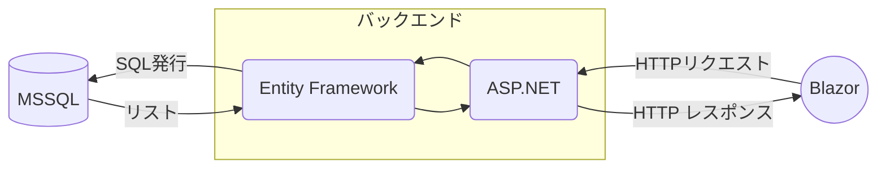
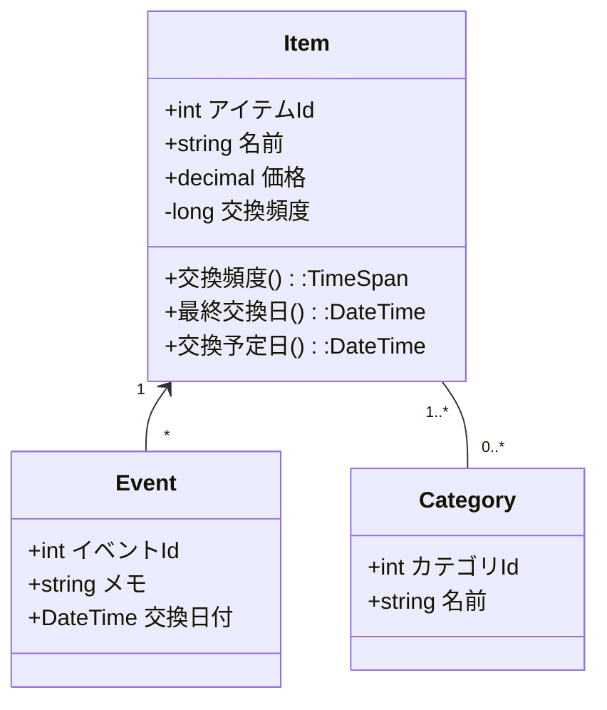

# アプリ概要

自転車のパーツなどの交換を、パーツごとに交換の記録と交換頻度の設定をすることで管理するアプリ。

## 使用技術

- フロント
  - Blazor WebAssembly
- バック
  - ASP.NET Core(API作成)
  - Entity Framework(データベース管理)
  - MS SQL(データベース)

### データ図

### クラス図

#### クラス補足

- 交換頻度を設定しない場合はNullにする。
- 交換頻度はlongで持ち、プロパティでTimeSpanに変換すること。
  - DBにTimeSpan型が無いため。
- 最終交換日＝最後に発生したイベントの日付
- 交換予定日＝最終交換日+交換頻度で計算する。
  - 交換頻度を設定しない場合はNullで返す。

## 画面

- 基本的にはスマホを想定、余裕があればレスポンシブ。
- アイテムの一覧を表示する。
  - カテゴリでの絞り込みを実装。
  - 交換予定日が近いアイテム/交換予定日を過ぎているアイテムに色付け。