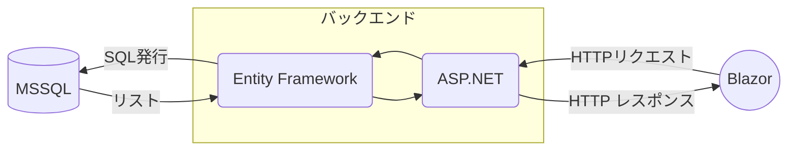
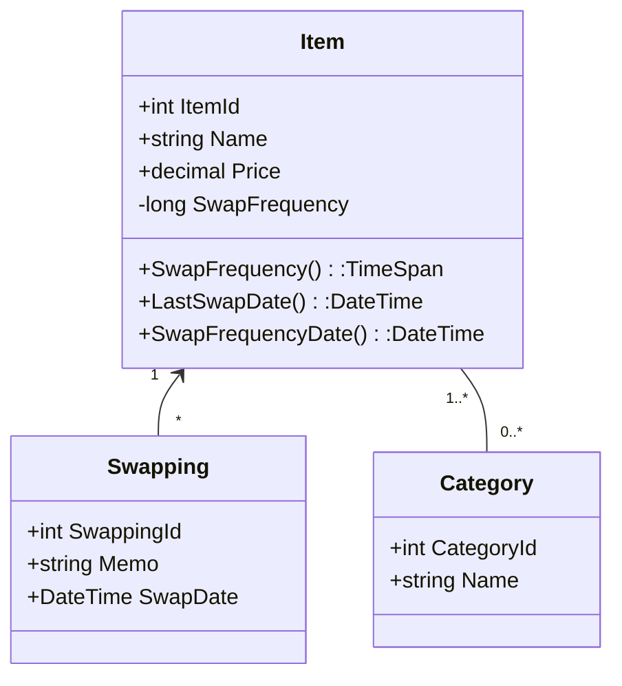
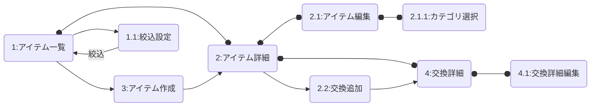

# アプリ概要

自転車のパーツなどの交換を、パーツごとに交換の記録と交換頻度の設定をすることで管理する。

## 使用技術

- フロント
  - Blazor WebAssembly
- バック
  - ASP.NET Core(API作成)
  - Entity Framework(データベース管理)
  - MS SQL(データベース)

### データ図

### クラス図

クラスのフィールドはフロントとバックで同じものを定義する。

プロパティはフロントでのみ定義する。

#### API一覧

|クラス|メソッド|URL|説明|
|--|--|--|--|
|Item|GET|/Item|一覧を取得|
|Item|GET|/Item/{ID}|1つ取得|
|Item|GET|/Item/data?name=|nameで検索（部分一致）|
|Item|PUT|/Item/{ID}|編集|
|Item|DELETE|/Item/{ID}|削除|
|Item|POST|/Item|/Item|作成|
|Item|POST|/Item/{id}/Swapping|ItemにSwappingを追加|
|Swapping|GET|/Swapping|一覧を取得|
|Swapping|GET|/Swapping/{ID}|1つ取得|
|Swapping|DELETE|/Swapping/{ID}|削除|
|Swapping|POST|/Swapping/{ID}|編集|
|Category|GET|/Category|一覧を取得|
|Category|GET|/Category/{ID}|一つ取得|
|Category|POST|/Category|作成|
|Category|DELETE|/Category/{ID}|削除|

#### クラス補足

- 交換頻度を設定しない場合はNullにする。
- 交換頻度はlongで持ち、プロパティでTimeSpanに変換すること。
  - DBにTimeSpan型が無いため。
- 最終交換日＝最後に発生したイベントの日付
- 交換予定日＝最終交換日+交換頻度で計算する。
  - 交換頻度を設定しない場合はNullで返す。

## 画面概要

- 基本的にはスマホを想定だが、PCでの利用も想定しているのでレスポンシブも検討。
- アイテムの一覧を表示する。
  - カテゴリでの絞り込みを実装。
  - 交換予定日が近い（1-2週？設定で変更可能にすることも検討）アイテム/交換予定日を過ぎているアイテムに色付け。
- アイテムにカテゴリを設定する画面で、カテゴリを新規追加できるようにする。

### 画面遷移

アプリ起動時はアイテム一覧画面を開く

絞込設定以外はそれぞれ一つの画面とする

絞込設定はモーダルウィンドウもしくはフレームなどを用いたサブ画面とする。

()内はルーティング

1. アイテム一覧(/もしくは/item)
   1. 絞込設定
2. アイテム詳細(/item/{id})
   1. アイテム編集
      1. カテゴリ選択
   2. 交換追加
3. アイテム追加(/item/new)
4. 交換詳細(/swapping/{id})
   1. 交換詳細編集
